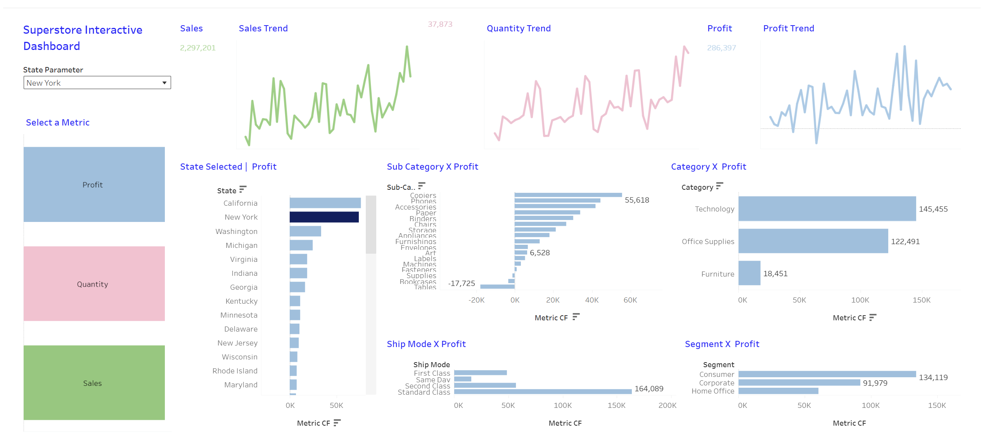

# Superstore Interactive Dashboard – Tableau

## Project Overview

This project is an interactive Tableau dashboard created using Superstore data to analyze sales, profit, quantity, and business performance.

## Dashboard Preview

## Key Features

- Sales trend analysis
- Quantity trend analysis
- Profit trend analysis
- State-wise profit analysis
- Category-wise performance
- Sub-category-wise profit analysis
- Ship mode analysis
- Customer segment analysis
- Interactive state selection
- Dynamic metric selection

## Tools Used

- Tableau
- Data Visualization
- Calculated Fields
- Parameters
- Filters
- Interactive Dashboards
- Data Analysis

## Tableau Public

View the interactive dashboard:

[View Dashboard on Tableau Public](https://public.tableau.com/views/SuperstoreinteractiveDasshboard/Dashboard1?:language=en-US&:sid=&:redirect=auth&:display_count=n&:origin=viz_share_link)

## Skills Demonstrated

- Data visualization
- Dashboard development
- Exploratory data analysis
- Interactive reporting
- Business insights
- Data storytelling
